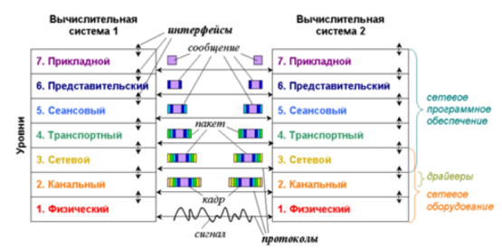

# 1. Модель OSI.

**Международная Организация по Стандартам (International Standards Organization, ISO)** разработала модель, которая определяет различные уровни 
взаимодействия систем, дает им стандартные имена и указывает, какую работу должен делать каждый уровень. Эта модель называется **моделью
взаимодействия открытых систем (Open System Interconnection, OSI)** или моделью ISO/OSI.
Модель взаимодействия открытых систем (OSI) принята Международной организацией по стандартизации (ISO) в **1983 г**.

